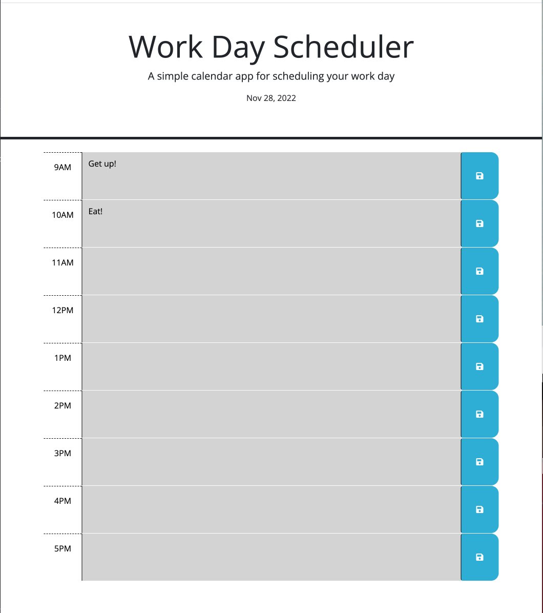

# Work-Day-Scheduler

> Live demo [_here_](https://cadienlake.github.io/work-day-scheduler/).

## Table of Contents

- [General Info](#general-information)
- [Screenshot](#screenshot)
- [Features](#features)
- [Project Status](#project-status)
- [Acknowledgements](#acknowledgements)

## General Information

This is a website that allows you to enter to-do's for each hour of the day and save them to your local storage, so that when you reload the page it will still show what needs to be done. You can delete the task and save to clear that hour's to-do. The current hour displays red, the past hours grey, and future hours green.

## Screenshot

## Features

This quiz website includes

- Text entry for each hour
- Buttons to save that text entry

## Project Status

Project is: _finished_.

## Acknowledgements

- This project was created with assistance from our bootcamp instructor and student conversations. Thanks for the teamwork!
